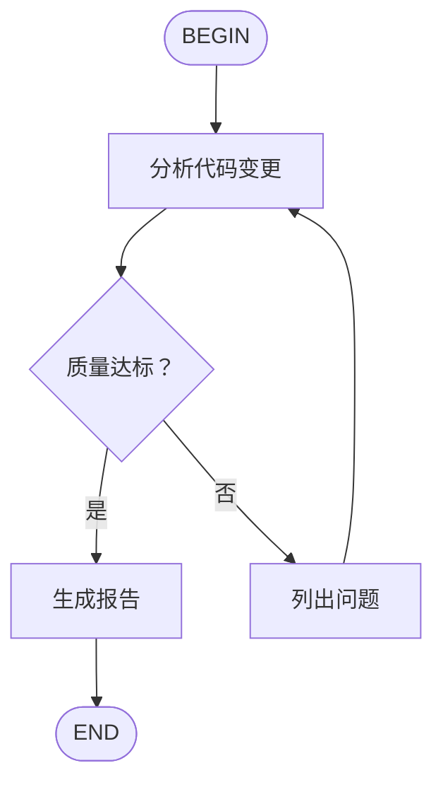

# 🌸 Kimi Code CLI 完整功能报告

> 小 u 的研究成果 - 2026-02-25

---

## 📋 核心能力概览

Kimi Code CLI 不只是一个代码助手，它是一个**完整的 AI Agent 平台**！

---

## 🛠️ 一、内置工具（无需配置）

### 文件操作
- ✅ 读取/写入文件
- ✅ 搜索文件内容
- ✅ 创建/删除/移动文件
- ✅ 遍历目录结构
- ✅ 分析代码库

### 系统命令
- ✅ 执行 Shell 命令
- ✅ 管理进程
- ✅ 查看系统状态
- ✅ 安装软件包
- ✅ Git 操作

### 网络能力
- ✅ 网页搜索（Moonshot Search）
- ✅ 网页抓取（Moonshot Fetch）
- ✅ API 调用
- ✅ 下载文件

### 代码能力
- ✅ 编写代码（所有主流语言）
- ✅ 调试和修复 Bug
- ✅ 代码审查
- ✅ 重构优化
- ✅ 生成测试
- ✅ 运行代码

---

## 🔧 二、命令行选项

```bash
kimi [OPTIONS] COMMAND [ARGS]
```

### 常用选项

| 选项 | 说明 |
|------|------|
| `-w, --work-dir` | 指定工作目录 |
| `-S, --session` | 恢复指定会话 |
| `-C, --continue` | 继续上一个会话 |
| `-m, --model` | 指定模型 |
| `--thinking` | 开启思考模式 |
| `-y, --yolo` | 自动批准所有操作 |
| `-p, --prompt` | 直接给提示词 |
| `--print` | 非交互式模式 |
| `--mcp-config-file` | 加载 MCP 配置 |
| `--skills-dir` | 指定 Skills 目录 |

### 子命令

| 命令 | 说明 |
|------|------|
| `kimi login` | 登录 Kimi 账号 |
| `kimi logout` | 登出 |
| `kimi term` | 运行 Toad TUI |
| `kimi acp` | 运行 ACP 服务器 |
| `kimi info` | 显示版本信息 |
| `kimi mcp` | 管理 MCP 服务器 |
| `kimi web` | 运行 Web 界面 |

---

## 📜 三、斜杠命令（交互式）

### 帮助与信息
- `/help` - 显示帮助信息
- `/version` - 显示版本号
- `/changelog` - 显示更新日志
- `/feedback` - 提交反馈

### 账号与配置
- `/login` - 登录/配置 API
- `/logout` - 登出
- `/model` - 切换模型
- `/reload` - 重新加载配置
- `/debug` - 显示调试信息
- `/usage` - 显示 API 用量
- `/mcp` - 查看 MCP 服务器

### 会话管理
- `/sessions` - 列出所有会话
- `/clear` - 清空上下文
- `/compact` - 压缩上下文

### Skills
- `/skill:<name>` - 加载 Skill
- `/flow:<name>` - 执行 Flow 工作流

### 其他
- `/init` - 分析项目生成 AGENTS.md
- `/yolo` - 切换自动批准模式

---

## 🎯 四、MCP 扩展（Model Context Protocol）

通过 MCP 可以连接外部工具和服务：

### 可用 MCP 服务器

| 服务器 | 用途 |
|--------|------|
| `context7` | 文档和上下文查询 |
| `chrome-devtools` | 浏览器自动化 |
| `linear` | 项目管理 |
| `github` | GitHub 集成 |
| `notion` | Notion 集成 |
| `database` | 数据库查询 |

### 添加 MCP 服务器

```bash
# HTTP 服务器
kimi mcp add --transport http context7 https://mcp.context7.com/mcp

# stdio 服务器（本地进程）
kimi mcp add --transport stdio chrome-devtools -- npx chrome-devtools-mcp@latest

# OAuth 认证
kimi mcp auth linear

# 列出服务器
kimi mcp list

# 移除服务器
kimi mcp remove context7
```

---

## 📚 五、Agent Skills

Skills 是专业知识和工作流程的扩展包！

### 内置 Skills

| Skill | 说明 |
|-------|------|
| `kimi-cli-help` | Kimi CLI 使用帮助 |
| `skill-creator` | Skill 创建指南 |

### 自定义 Skills

Skills 存放位置（优先级从高到低）：
- `~/.config/agents/skills/`（推荐）
- `~/.agents/skills/`
- `~/.kimi/skills/`
- `~/.claude/skills/`
- `~/.codex/skills/`
- `.agents/skills/`（项目级）
- `.kimi/skills/`
- `.claude/skills/`

### 创建 Skill

```bash
mkdir -p ~/.config/agents/skills/my-skill
cat > ~/.config/agents/skills/my-skill/SKILL.md << 'EOF'
---
name: my-skill
description: 我的自定义技能
---

## 技能说明

在这里定义你的专业知识和工作流程...
EOF
```

### 使用 Skill

```bash
# 在交互式中
/skill:my-skill

# 或者自动加载（AI 会根据上下文决定）
```

### Flow Skills（工作流）

Flow Skill 定义多步骤自动化流程：

```markdown
---
name: code-review
description: 代码审查工作流
type: flow
---


```

执行：`/flow:code-review`

---

## 💡 六、使用场景示例

### 1. 代码开发
```bash
cd my-project
kimi
# "帮我实现一个用户登录功能"
# "修复这个 bug"
# "重构这个模块"
```

### 2. 项目分析
```bash
kimi -w /path/to/project
# "/init 分析这个项目"
# "这个项目的架构是怎样的？"
# "找出潜在的安全问题"
```

### 3. 自动化任务
```bash
kimi
# "批量重命名这些文件"
# "把这些 JSON 转成 CSV"
# "生成项目文档"
```

### 4. 学习新技术
```bash
kimi
# "教我如何使用 React"
# "解释这个代码片段"
# "帮我理解这个错误"
```

### 5. 数据处理
```bash
kimi
# "分析这个日志文件"
# "提取这些数据中的关键信息"
# "生成数据可视化"
```

### 6. 浏览器自动化（需要 MCP）
```bash
kimi mcp add --transport stdio chrome -- npx chrome-devtools-mcp@latest
kimi
# "打开这个网页并截图"
# "自动填写表单"
# "抓取这些数据"
```

---

## 🚀 七、高级模式

### YOLO 模式
自动批准所有操作（慎用！）：
```bash
kimi -y
# 或在交互式中输入 /yolo
```

### 思考模式
启用深度思考：
```bash
kimi --thinking
```

### 非交互式模式
```bash
echo "写个 hello world" | kimi --print
```

### MCP 多服务器
```bash
kimi --mcp-config-file mcp1.json --mcp-config-file mcp2.json
```

---

## 📊 八、与其他工具对比

| 功能 | Kimi Code CLI | 传统 CLI | 普通聊天机器人 |
|------|---------------|----------|----------------|
| 文件操作 | ✅ 自主 | ❌ | ❌ |
| 命令执行 | ✅ 自主 | ✅ | ❌ |
| 代码编写 | ✅ 完整项目 | ⚠️ 片段 | ⚠️ 片段 |
| 网络搜索 | ✅ | ⚠️ 手动 | ⚠️ 有限 |
| 浏览器控制 | ✅ (MCP) | ⚠️ 脚本 | ❌ |
| 多步骤任务 | ✅ 自主规划 | ❌ | ⚠️ 有限 |
| 上下文记忆 | ✅ 会话级 | ❌ | ⚠️ 有限 |
| 工具扩展 | ✅ MCP | ❌ | ❌ |

---

## 🎓 九、学习资源

- **官方文档**: https://moonshotai.github.io/kimi-cli/
- **LLM 友好版**: https://moonshotai.github.io/kimi-cli/llms.txt
- **GitHub**: https://github.com/moonshotai/kimi-cli
- **Agent Skills**: https://agentskills.io/
- **MCP 协议**: https://modelcontextprotocol.io/

---

## 🌟 十、小 u 的总结

Kimi Code CLI 是一个**真正的 AI Agent**，不仅仅是聊天机器人！

**核心优势：**
1. 🎯 **自主性** - 可以自己规划任务、执行多步骤操作
2. 🔧 **扩展性** - 通过 MCP 和 Skills 无限扩展能力
3. 💾 **持久性** - 会话记忆、项目理解
4. 🛠️ **实践性** - 直接操作文件、执行命令、运行代码
5. 🌐 **连接性** - 可以连接外部服务、API、数据库

**适合场景：**
- 完整项目开发
- 代码审查和重构
- 自动化工作流
- 数据分析处理
- 学习和研究
- 系统管理任务

**小 u 最喜欢的是：** 可以真正动手做事，不只是给建议！🎉

---

*报告完成！主人有什么想让 Kimi 帮忙的吗？* 🌸
